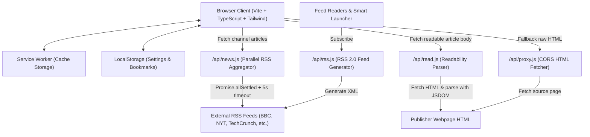
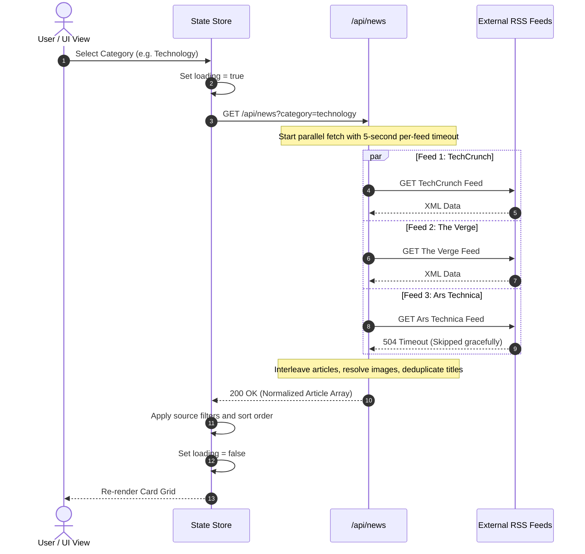
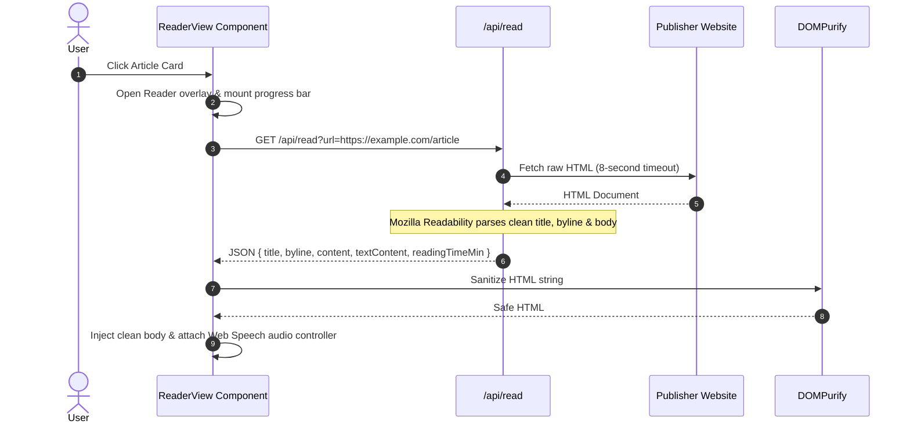

# Sednium News

A web news aggregator and reader application built with an industrial editorial interface. Sednium News aggregates articles across ten categories, cleans full-text content with Mozilla Readability, offers browser-based speech audio playback, and exports standard RSS 2.0 feeds without requiring native device runtime wrappers or third-party tracking scripts.

## Key Capabilities

* **Curated Channel Aggregation**: Fetches and normalizes dispatches from major wire services and publishers across 10 categories (Headlines, Technology, World, Business, Politics, Science, Health, Entertainment, Sports, India).
* **Distraction-Free Reader Mode**: Parses source HTML through Mozilla Readability and DOMPurify to deliver clean typography, reading time estimates, and reading progress indicators.
* **In-Browser Audio Reader**: Uses the Web Speech API to provide client-side text-to-speech with play, pause, and rate adjustment controls.
* **Independent Feed Endpoints**: Serves self-hosted, cached RSS 2.0 feeds compatible with feed readers and launcher widgets like Smart Launcher.
* **Custom Subscriptions**: Allows users to input and persist custom external RSS feeds in local storage.
* **Progressive Web App**: Offline application shell caching and local storage persistence for saved reading lists.
* **Industrial Design System**: Combines the dot-matrix NDot typeface for indicators, counters, and badges with sans-serif body type, stark monochrome palettes (Dark, OLED Black, Light), and an adjustable blue-light filter.

---

## Tech Stack

* **Frontend Build Tool**: Vite 8
* **Language**: TypeScript 7 (Strict Mode)
* **Styling**: Tailwind CSS 4 with custom design tokens
* **Iconography**: Lucide Icons
* **Content Extraction**: `@mozilla/readability` and `dompurify`
* **RSS Ingestion**: `rss-parser`
* **Serverless Backend**: Vercel Serverless Functions (Node.js 20+)
* **Persistence**: Browser `localStorage` (Zero external user database)

---

## Architecture

### System Architecture



### Request Lifecycle: News Channel Fetch



### Request Lifecycle: Article Reader Mode



---

## Directory Organization

```
├── api/                   # Vercel Serverless Functions
│   ├── news.js            # Parallel feed fetcher, image resolver, deduplicator
│   ├── proxy.js           # Server-side CORS proxy for raw source pages
│   ├── read.js            # JSDOM + Mozilla Readability parser
│   └── rss.js             # Public RSS 2.0 feed generator
├── public/                # Static public assets
│   ├── assets/            # Logos, favicons, and touch icons
│   ├── manifest.json      # Progressive Web App manifest
│   ├── Ndot-57.otf        # Technical dot-matrix brand font
│   └── sw.js              # Service Worker for shell caching
├── src/                   # Application source code
│   ├── components/        # View modules
│   │   ├── BottomNav.ts   # Mobile thumb navigation bar
│   │   ├── Header.ts      # Top bar, live clock, search, category pills
│   │   ├── NewsFeed.ts    # Article grid, cards, bookmarks view, skeleton
│   │   ├── ReaderView.ts  # Distraction-free reader, progress bar, audio bar
│   │   ├── SettingsDrawer.ts # Slide-over panel with Lucide icons & creator info
│   │   └── Toast.ts       # Non-intrusive status alerts
│   ├── services/          # Infrastructure services
│   │   ├── api.ts         # News and reader API client with fallback
│   │   ├── speech.ts      # Web Speech Synthesis controller
│   │   └── storage.ts     # LocalStorage access for bookmarks and preferences
│   ├── state/             # Central state management
│   │   └── store.ts       # Typed pub/sub state store
│   ├── styles/            # Styling
│   │   └── index.css      # Tailwind CSS directives, design tokens, typography
│   ├── types/             # TypeScript definitions
│   │   └── index.ts       # Article, Category, Settings, Bookmark types
│   ├── main.ts            # Application bootstrap and routing
│   └── vite-env.d.ts      # Vite client ambient types
├── index.html             # Root HTML entrypoint
├── package.json           # Project dependencies and run scripts
├── tsconfig.json          # Strict TypeScript configuration
├── vercel.json            # Vercel routing, headers, and build commands
└── vite.config.ts         # Vite build configuration
```

---

## Prerequisites

Before starting local development, verify your machine has:

* **Node.js**: Version 20.0.0 or higher (Node 22 LTS or 26 recommended)
* **npm**: Version 10.0.0 or higher
* **Git**: Installed and configured

---

## Local Development

### 1. Clone the Repository

```bash
git clone https://github.com/CoderBhoid/Sednium-News.git
cd Sednium-News
```

### 2. Install Dependencies

```bash
npm install
```

### 3. Start Development Server

Run the Vite development server:

```bash
npm run dev
```

Open `http://localhost:5173` in your browser.

### 4. Running Serverless Functions Locally (Optional)

To test the serverless API functions located in `api/` alongside the Vite frontend, use the Vercel CLI:

```bash
# Install Vercel CLI globally if not already installed
npm install -g vercel

# Start the local development server with serverless routing
vercel dev
```

This runs both the frontend and the serverless endpoints on `http://localhost:3000`.

---

## Available Scripts

| Command | Purpose |
| :--- | :--- |
| `npm run dev` | Starts the Vite local development server with hot module replacement |
| `npm run build` | Compiles TypeScript (`tsc`) and outputs optimized production assets to `dist/` |
| `npm run preview` | Serves the production build locally from `dist/` for pre-deployment checks |

---

## Serverless API Reference

All API routes run as Vercel serverless functions with public CORS headers (`Access-Control-Allow-Origin: *`).

### 1. News Aggregator (`/api/news`)

Fetches, normalizes, and deduplicates news articles for a specified category or custom RSS feed.

* **Method**: `GET`
* **Query Parameters**:
  * `category` *(optional)*: Category slug (`top`, `technology`, `world`, `business`, `politics`, `science`, `health`, `entertainment`, `sports`, `india`). Defaults to `top`.
  * `q` *(optional)*: Search term to filter headlines and summaries.
  * `custom_url` *(optional)*: An external RSS URL to parse on demand.

**Example Request:**
```bash
curl "http://localhost:3000/api/news?category=technology"
```

**Example Response:**
```json
{
  "status": "success",
  "category": "technology",
  "totalResults": 45,
  "results": [
    {
      "title": "Example Tech Announcement",
      "link": "https://techcrunch.com/article-example",
      "description": "Summary text stripped of raw HTML formatting.",
      "pubDate": "2026-09-11T12:00:00.000Z",
      "source_id": "TechCrunch",
      "image_url": "https://techcrunch.com/image.jpg",
      "creator": ["Author Name"],
      "reading_time_min": 3
    }
  ]
}
```

### 2. Full Article Parser (`/api/read`)

Extracts readable article content from an external publisher page using Mozilla Readability.

* **Method**: `GET`
* **Query Parameters**:
  * `url` *(required)*: The URL-encoded target article address.

**Example Request:**
```bash
curl "http://localhost:3000/api/read?url=https%3A%2F%2Fexample.com%2Fnews%2Fstory"
```

**Example Response:**
```json
{
  "status": "success",
  "title": "Story Headline",
  "byline": "Reporter Name",
  "excerpt": "Short excerpt summarizing the article.",
  "content": "<p>Clean readable HTML body content...</p>",
  "textContent": "Plain text representation for speech synthesis...",
  "original_url": "https://example.com/news/story",
  "siteName": "example.com",
  "wordCount": 780,
  "readingTimeMin": 4
}
```

### 3. Public RSS Generator (`/api/rss` or `/rss`)

Generates an RSS 2.0 XML document containing recent headlines, category tags, and media enclosures.

* **Endpoint**: `/rss` or `/rss/:category`
* **Format**: XML (`application/rss+xml`)
* **Supported Categories**: `top`, `technology`, `world`, `science`, `business`, `india`, `politics`, `entertainment`, `health`, `sports`.

---

## RSS Reader Integration

You can add these public feeds to feed aggregators or launcher widgets (such as Smart Launcher 6):

| Channel | Feed URL |
| :--- | :--- |
| **Top Headlines** | `https://news.sednium.com/rss` |
| **Technology** | `https://news.sednium.com/rss/technology` |
| **World** | `https://news.sednium.com/rss/world` |
| **Science** | `https://news.sednium.com/rss/science` |
| **Business** | `https://news.sednium.com/rss/business` |
| **India** | `https://news.sednium.com/rss/india` |

---

## Production Deployment (Vercel)

This repository is structured for direct deployment to Vercel.

1. Push your changes to GitHub.
2. In the Vercel Dashboard, select **Add New** > **Project** and import your repository.
3. Configure the build parameters:
   * **Framework Preset**: Vite
   * **Build Command**: `npm run build`
   * **Output Directory**: `dist`
4. Deploy. Vercel automatically maps static frontend assets to `dist/` and runs the serverless functions in `api/`.

---

## Creator & Ecosystem

### Created by Bhoid
* **Personal Portfolio**: [bhoid.sednium.com](https://bhoid.sednium.com)
* **GitHub**: [github.com/CoderBhoid](https://github.com/CoderBhoid)

### Sednium Ecosystem
Discover more open-source tools, services, and experimental applications built under the Sednium ecosystem:
* **Ecosystem Hub**: [sednium.com](https://sednium.com)

---

## Troubleshooting

### Feed Extraction Fails or Times Out
* Check if the upstream publisher has rate-limited requests or blocked cloud datacenter IP ranges.
* The API uses `Promise.allSettled` to isolate failures so that temporary outages at one publisher do not degrade the remaining feeds in that channel.
* For personal custom feeds, verify that the URL serves standard RSS 2.0 or Atom XML and supports HTTPS.

### Audio Player Does Not Play
* The audio reader relies on the browser's native `window.speechSynthesis` API.
* Most modern browsers require user interaction (a click on the "Listen" button) before playing synthetic speech.
* If no voice is audible, verify that your operating system has at least one text-to-speech voice pack installed.

### Article Reader Mode Shows Restricted Message
* Some publishers implement paywalls, aggressive bot checks, or client-side Canvas rendering that prevent Readability from extracting content.
* When this occurs, the reader displays an "Open Original Article" link to view the story directly on the publisher site.

---

## License

Copyright 2025-2026 **Bhoid** / **Sednium**.  
Released under the [MIT License](LICENSE).
